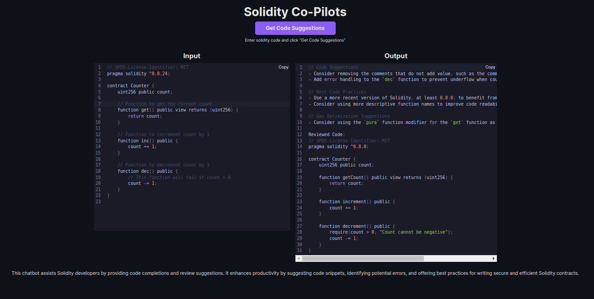

# Solidity Code Co-Pilots

Use AI to review your solidity code.



## Running Locally

**1. Clone Repo**

```bash
git clone https://github.com/thopatevijay/solidity-co-pilots.git
```

**2. Install Dependencies**

```bash
npm i
```

**3. Run App**

```bash
npm run dev
```

## Contact

If you have any questions, feel free to reach out to me on [Twitter](https://twitter.com/thopate_vijay).
