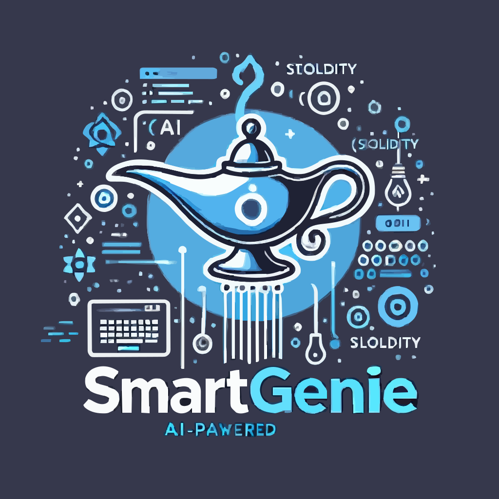
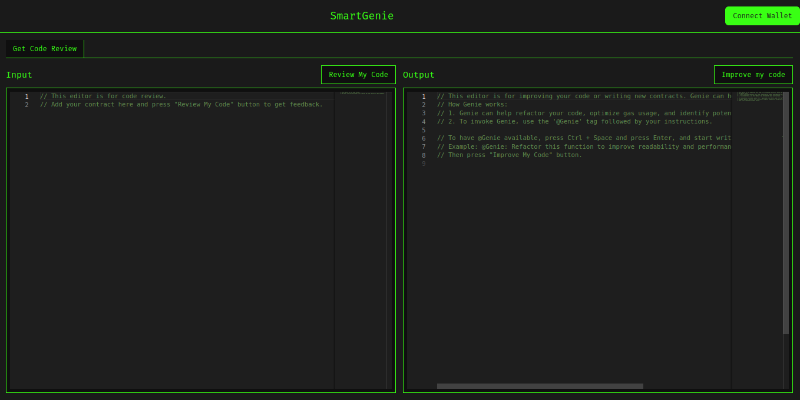

<div align="center">
<h1>SmartGenie</h1>
  
</div>
Use AI to review your Solidity code.



## Running Locally

1. **Clone Repo**

   ```bash
   git clone https://github.com/thopatevijay/SmartGenie.git
   ```

2. **Install Dependencies**

   ```bash
   npm i
   ```

3. **Run App**
   ```bash
   npm run dev
   ```

## Technical Stack

- **Frontend**: Next.js
- **AI Integration**: Galadriel's LLM Loops Agent
- **Styling**: Tailwind CSS

## LLM Loops Agent Integration

In Project Name, we have integrated a sophisticated LLM Loops Agent that enhances our platform's capabilities by performing iterative querying and responding. The agent is configured to use tools like `web_search` and `code_interpreter` to provide real-time data retrieval and code analysis functionalities.

### How It Works:

1. **Initialization**: The agent is initialized with specific prompts and configurations to perform tasks related to Solidity smart contracts.
2. **Tool Usage**:
   - **web_search**: Used to fetch real-time data and best practices from the internet.
   - **code_interpreter**: Executes Solidity code snippets for analysis and validation.
3. **Iterative Process**: The agent performs multiple iterations to refine responses and provide the most accurate and relevant suggestions.

## Links

- **Live Project**: [Live Project Link](https://smart-genie.vercel.app/)
- **Contract Address**: [0xC2d7B3Fa552c49cf4fb1d7FBD8c58cf41e34a5C8](https://explorer.galadriel.com/address/0xC2d7B3Fa552c49cf4fb1d7FBD8c58cf41e34a5C8)

## Flow Diagram


## Future Enhancements / Coming Features

- **Enhanced Analytics**: Advanced analytics dashboard to provide insights into smart contract performance and usage statistics.
- **Code Suggestions**: Provide real-time code suggestions similar to GitHub Copilot.
- **VS Code Extension**: Develop an extension for VS Code to integrate AI code reviews directly.
- **Advanced AI Features**: Implement advanced AI algorithms for better code analysis and optimization suggestions.
- **Collaboration Tools**: Enable real-time collaboration for teams working on Solidity projects.

## Contact

If you have any questions, feel free to reach out to me on [Twitter](https://x.com/thopate_vijay).
