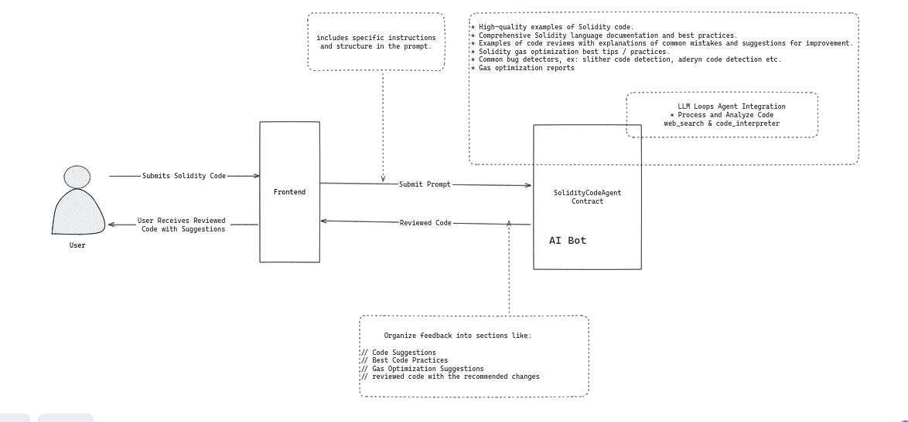

# Solidity Code Co-Pilots

Use AI to review your Solidity code.


## Running Locally

1. **Clone Repo**

   ```bash
   git clone https://github.com/thopatevijay/solidity-co-pilots.git
   ```

2. **Install Dependencies**

   ```bash
   npm i
   ```

3. **Run App**
   ```bash
   npm run dev
   ```

## Technical Stack

- **Frontend**: Next.js
- **Backend**: Node.js,
- **AI Integration**: Flock's AI Co-Creation Platform
- **Styling**: Tailwind CSS

## Links

- **AI Bot Resources and Parameters**: [AI Bot Link](https://beta.flock.io/model/clxrgmu3a0021he5r7ka3vqg1)
- **Live Project**: [Live Project Link](https://solidity-co-pilots-9lms.vercel.app/)

## Flow Diagram




## Future Enhancements / Coming Features

- **Solidity Code Editor**: Integrate Monaco Editor for a seamless coding experience.
- **Code Suggestions**: Provide real-time code suggestions similar to GitHub Copilot.
- **VS Code Extension**: Develop an extension for VS Code to integrate AI code reviews directly.
- **User Accounts**: Add user account features to save and load code review history.
- **Advanced AI Features**: Implement advanced AI algorithms for better code analysis and optimization suggestions.
- **Collaboration Tools**: Enable real-time collaboration for teams working on Solidity projects.

## Contact

If you have any questions, feel free to reach out to me on [Twitter](https://x.com/thopate_vijay).
